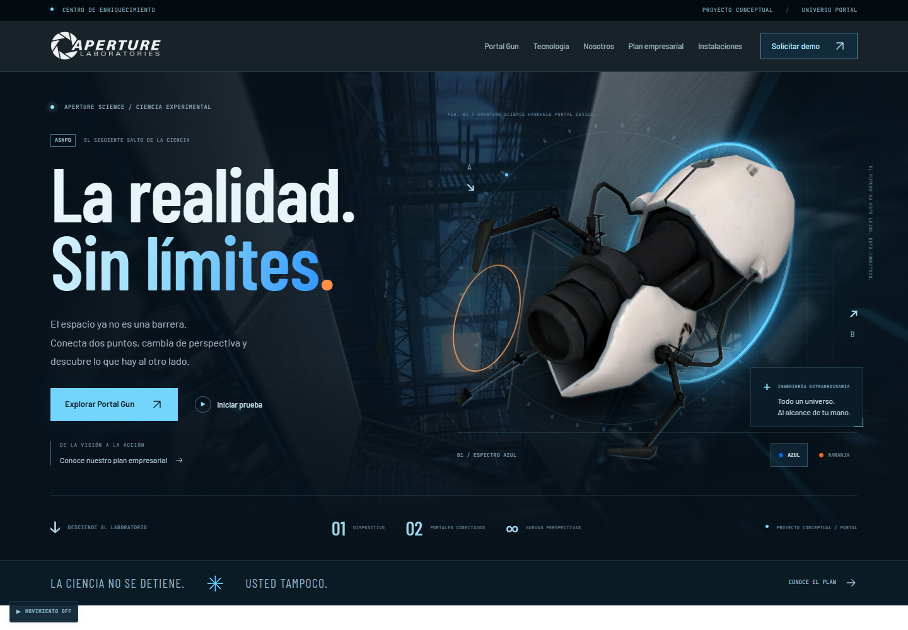

# Aperture Science · La realidad. Sin límites.

Sitio empresarial e interactivo inspirado en **Portal y Portal 2**, de Valve. Combina la presentación de la Portal Gun con una propuesta académica de planeación empresarial, en una interfaz tecnológica con identidad azul y naranja.

**Proyecto conceptual de fans.** No representa a Valve, no vende dispositivos reales y el formulario es una simulación local: no envía ni registra solicitudes en un servidor.



## Contenido

- Landing page, presentación del producto, demostración de portales y galería de instalaciones.
- Filosofía empresarial: misión, visión y valores.
- Análisis FODA con **20 factores**: cinco fortalezas, cinco oportunidades, cinco debilidades y cinco amenazas.
- **Tres objetivos SMART**, cada uno con su estrategia y su plan de acción: **tres estrategias y tres planes** en total.
- Organigrama, responsabilidades por departamento, cultura de trabajo y cuatro compromisos verificables.
- Diseño adaptable a móvil, navegación por secciones y recursos gráficos y fuentes locales.

Las metas, indicadores y textos de negocio son propuestas para un ejercicio académico; no describen resultados reales de Aperture Science ni información oficial del juego.

## Ejecutar en tu computadora

Instala **Node.js 24** y abre una terminal dentro de la carpeta que contiene este README y `package.json`.

```bash
npm ci
npm run dev
```

Abre [http://127.0.0.1:5173](http://127.0.0.1:5173). Si ese puerto está ocupado, Vite mostrará otro en la terminal.

## Comandos

| Comando | Función |
| --- | --- |
| `npm run dev` | Desarrollo con actualización automática |
| `npm run typecheck` | Revisar tipos de TypeScript |
| `npm test` | Verificar la integridad del FODA y la relación objetivo → estrategia → plan |
| `npm run build` | Revisar tipos y generar `dist/` |
| `npm run preview` | Revisar `dist/` en un servidor local |

No abras `index.html` del código fuente con doble clic: React necesita el servidor de desarrollo o la versión compilada servida por HTTP.

## Subir a GitHub

**Descomprime el ZIP y sube el contenido de esta carpeta como un solo proyecto**, incluyendo `.github/`. No subas el ZIP como sustituto del código, ni `node_modules/` ni `dist/`.

Sigue [la guía de GitHub](docs/GITHUB.md) para crear el repositorio y, si quieres, publicar la web con GitHub Pages. La compilación y las pruebas de integridad se ejecutan con cada push y pull request. La publicación requiere ejecutar manualmente el flujo de Pages.

## Estructura

```text
.github/workflows/   Verificación y publicación manual
docs/               Guías de entrega, planeación y licencias
public/             Recursos estáticos públicos
src/                Componentes, estilos, contenido y assets
tests/              Pruebas de integridad del plan empresarial
index.html          Entrada HTML y metadatos
vite.config.ts      Configuración de desarrollo y compilación
package.json        Comandos y dependencias
package-lock.json   Versiones reproducibles
```

React 19 · TypeScript · Vite 8 · Tailwind CSS 4. El resultado de compilación es un sitio estático; no requiere cuentas, claves de API ni backend.

## Recursos y documentación

[Contenido vigente del sitio](docs/SITE_CONTENT.md) · [Inventario de assets](ASSETS.md) · [Licencias y atribuciones](docs/LICENCIAS.md) · [Guía de GitHub](docs/GITHUB.md) · [Verificación](docs/VERIFICACION.md)

El arte y las marcas del videojuego conservan sus derechos originales. Este repositorio no concede una licencia abierta sobre esos recursos.
